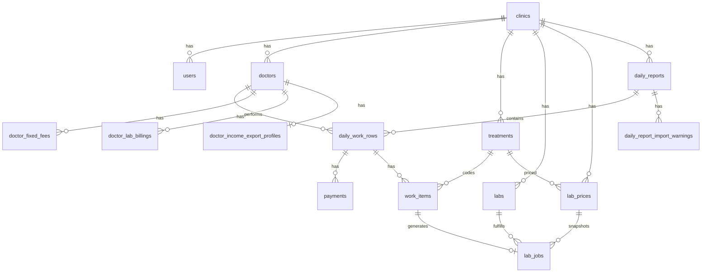

# DentalFinance — Codebase Guide

Dauerhafte Einarbeitungsdokumentation für Entwickler. Beschreibt die **tatsächliche** Architektur des Repositories auf dem Stand von `main` / Branch `docs/codebase-guide`.

**Verwandte Dokumente:**

- `docs/BUSINESS_RULES.md` — fachliche Buchhaltungsregeln
- `docs/DATABASE_SCHEMA.md` — detailliertes Schema
- `docs/DECISIONS.md` — Architecture Decision Records (ADRs)
- `docs/TREATMENT_RULES.md` — Treatment-Text-Format für Imports

---

## 1. Projektüberblick

### Fachlicher Zweck

**DentalFinance** ist eine webbasierte Buchhaltungsanwendung für Zahnarztpraxen (Multi-Tenant). Sie erfasst monatliche **Daily Reports** — entweder per Excel-Import oder manuell im Editor — und berechnet daraus:

- eingezogene Zahlungen (Revenue)
- Labor-Kosten (JOB)
- Arzt-Provisionen (Doctor Income)
- Klinik-Anteil (Clinic Income)
- monatliche Übersichten und Excel-Exporte („Server Income“)

### Gelöste Probleme

| Problem | Lösung im System |
|---|---|
| Excel-basierte Tagesberichte manuell auswerten | Automatischer Import + Parser |
| Uneinheitliche Treatment-Codes | Zentraler `treatments`-Katalog pro Clinic |
| Labor-Kosten pro Arzt/Behandlung | `lab_prices` + `LabJobCalculationService` |
| Provisionsmodelle (Prozent vs. Festhonorar) | `doctors.commission_*` + `doctor_fixed_fees` |
| Mehrere Praxen auf einer Plattform | Tenant-Isolation über `clinic_id` |
| Datenschutz bei Patientendaten | HMAC-Hash statt Klartext, sanitisierte `raw_data_json` |

### Zentrale Module

| Modul | Verzeichnis / Einstieg |
|---|---|
| Tenant & Konfiguration | `app/Services/Configuration/` |
| Accounting-Kern | `app/Services/Accounting/` |
| Daily Report Editor | `app/Services/DailyReport/` |
| Import | `app/Services/Import/` |
| Export | `app/Services/Export/` |
| Practice Overview | `app/Services/Analytics/` |
| Web-UI | `app/Http/Controllers/Web/`, `resources/views/` |
| REST-API | `app/Http/Controllers/Api/`, `routes/api.php` |

### Technische Architektur

- **Framework:** Laravel 13, PHP 8.3
- **Frontend:** Blade-Templates, Vanilla JavaScript (kein Alpine, keine SPA)
- **API-Auth:** Laravel Sanctum (`auth:sanctum`)
- **Web-Auth:** Session (`auth`, `verified`)
- **Rollen:** `admin`, `accountant`, `viewer` via Middleware `role:…`
- **Business-Logik:** überwiegend in **Services**; Controller bleiben dünn
- **Keine Laravel Policies**, keine globalen Eloquent-Scopes

### Datenbanken

| Umgebung | Technologie | Hinweis |
|---|---|---|
| Lokal / Tests | SQLite (`database/database.sqlite`) | Standard für `php artisan test` |
| Production | PostgreSQL 16 (Docker, intern) | Siehe `compose.production.yml` |

Migrationen liegen in `database/migrations/`. Seeders in `database/seeders/` liefern Referenzdaten für die Default-Clinic `CLINIC_111`.

### Konfiguration vs. Accounting-Daten

| Art | Beispiele | Änderungsverhalten |
|---|---|---|
| **Konfiguration** (Master Data) | `doctors`, `treatments`, `labs`, `lab_prices`, `doctor_fixed_fees` | Fachliche Deaktivierung (`is_active=false`), kein Hard Delete |
| **Accounting** (Transaktionsdaten) | `daily_reports`, `daily_work_rows`, `payments`, `work_items`, `lab_jobs` | Historisch unveränderlich nach Freigabe; `clinic_id` immutable |

**Zentrale Accounting-Kette:**

```
DailyReport → DailyWorkRow → Payments / WorkItems → LabJobs
```

Berechnete Resultate (Monthly Income, Overview, Export) werden **nicht** in eigenen `incomes`- oder `expenses`-Tabellen gespeichert.

---

## 2. Ordnerstruktur

### `app/Http/Controllers/Web/`

| | |
|---|---|
| **Verantwortung** | Session-basierte HTML-Responses |
| **Typische Dateien** | `ImportController`, `DailyReportEditorController`, `TreatmentAdminController` |
| **Aufrufer** | `routes/web.php` |
| **Erlaubte Abhängigkeiten** | Form Requests, Services, Models (Route Binding) |
| **Nicht hier** | Business-Logik, direkte komplexe Queries, Currency-Berechnungen |

### `app/Http/Controllers/Api/`

| | |
|---|---|
| **Verantwortung** | JSON-API für Sanctum-Clients |
| **Typische Dateien** | `DailyReportController`, `ReferenceDataController`, `MonthlyIncomeController` |
| **Aufrufer** | `routes/api.php` |
| **Erlaubte Abhängigkeiten** | Wie Web-Controller |
| **Nicht hier** | Blade-Views, Session-Logik |

### `app/Http/Middleware/`

| | |
|---|---|
| **Verantwortung** | Querschnitts-HTTP-Logik |
| **Dateien** | `EnsureUserHasRole.php`, `SecurityHeadersMiddleware.php` |
| **Aufrufer** | `bootstrap/app.php` (Alias `role`) |
| **Nicht hier** | Fachliche Validierung (→ Form Requests) |

### `app/Http/Requests/`

| | |
|---|---|
| **Verantwortung** | Eingabevalidierung, `BelongsToCurrentClinic`-Rules |
| **Typische Dateien** | `ImportDailyReportRequest`, `StoreDailyWorkRowRequest`, `RegisterClinicRequest` |
| **Aufrufer** | Controller-Methoden |
| **Nicht hier** | Persistenz, Berechnungen |

### `app/Models/` und `app/Models/Concerns/`

| | |
|---|---|
| **Verantwortung** | Eloquent-Modelle, Relationen, Casts |
| **Concerns** | `BelongsToClinic`, `ImmutableClinicOwnership` |
| **Aufrufer** | Services, Controller (Route Binding) |
| **Nicht hier** | Accounting-Formeln, Import-Parsing |

### `app/Services/Accounting/`

| | |
|---|---|
| **Verantwortung** | Kern-Buchhaltung: Zahlungen, Parser, Lab Jobs, Income |
| **Wichtige Dateien** | `PaymentCalculationService`, `TreatmentParserService`, `LabJobCalculationService`, `MonthlyIncomeCalculationService` |
| **Aufrufer** | Import, Editor, Export, Analytics |
| **Trait** | `Concerns/ScopesAccountingQueries.php` |

### `app/Services/Analytics/`

| | |
|---|---|
| **Verantwortung** | KPI-Aggregation (Practice Overview) |
| **Datei** | `ClinicFinancialOverviewService.php` |

### `app/Services/Configuration/`

| | |
|---|---|
| **Verantwortung** | Tenant-Auflösung, Admin-CRUD für Clinics, Onboarding |
| **Wichtige Dateien** | `CurrentClinicResolver`, `TenantResourceGuard`, `ClinicOnboardingService` |
| **Trait** | `Concerns/ScopesConfigurationQueries.php` |

### `app/Services/DailyReport/`

| | |
|---|---|
| **Verantwortung** | Manueller Editor, Report-Queries, Doctor-Anlage im Editor |
| **Wichtige Dateien** | `DailyReportEditorService`, `DailyReportQueryService`, `DoctorManagementService` |

### `app/Services/Import/`

| | |
|---|---|
| **Verantwortung** | Excel-Import-Pipeline, Parser, Validierung, Extraction Logs |
| **Wichtige Dateien** | `DailyReportImportService`, `ExcelDailyReportParser`, `TreatmentImportValidationService` |

### `app/Services/Export/`

| | |
|---|---|
| **Verantwortung** | Server-Income-Excel, Export-Profile |
| **Wichtige Dateien** | `DoctorsIncomeExcelExportService`, `DoctorIncomeExportProfileService` |

### `app/Services/Auth/`

| | |
|---|---|
| **Verantwortung** | Login, Throttling, Credential-Prüfung |
| **Dateien** | `AuthenticationService`, `LoginThrottleService` |

### `app/DTOs/`

| | |
|---|---|
| **Verantwortung** | Strukturierte Service-Ausgaben (readonly) |
| **Beispiele** | `MonthlyIncomeSummaryDto`, `Analytics/ClinicFinancialOverviewData` |
| **Nicht hier** | Persistenz |

### `app/Support/`

| | |
|---|---|
| **Verantwortung** | Hilfsklassen ohne HTTP-Bezug |
| **Wichtige Dateien** | `ClinicCurrencySupport`, `MoneyCalculator`, `ImportRowPrivacySanitizer`, `TreatmentTextBuilder` |

### `app/Enums/`

| | |
|---|---|
| **Verantwortung** | Typsichere Domain-Werte |
| **Beispiele** | `ReportStatus`, `CommissionType`, `PaymentMethod`, `UserRole` |

### `routes/`

| Datei | Inhalt |
|---|---|
| `web.php` | Blade-Routen, Session-Auth |
| `api.php` | Sanctum-API |
| `console.php` | Artisan-Befehle |

### `config/`

| Datei | Inhalt |
|---|---|
| `accounting.php` | Wechselkurse, Legacy-Clinic-Code, Upload-Limits |
| `mail.php`, `legal.php` | SMTP, rechtliche Texte |

### `database/`

| Unterordner | Inhalt |
|---|---|
| `migrations/` | Schema-Definitionen |
| `seeders/` | Referenzdaten |
| `factories/` | Test-Factories |

### `resources/`

| Unterordner | Inhalt |
|---|---|
| `views/` | Blade-Templates |
| `templates/` | `original_income_template.xlsx` |

### `tests/`

| Unterordner | Inhalt |
|---|---|
| `Feature/` | HTTP-End-to-End (~33 Dateien) |
| `Unit/` | Services, Parser, Currency (~49 Dateien) |

### `deploy/` und `.github/workflows/`

Production-Skripte, Caddyfile, CI/CD (`ci.yml`, `deploy-production.yml`).

### `docs/`

Projektdokumentation. Production-spezifische Runbooks können lokal ignoriert sein (siehe `.gitignore`).

---

## 3. Request-Lifecycle

> **Hinweis:** Es gibt **keinen Clinic-Switch** im UI. Flow C beschreibt die automatische Auflösung über `users.clinic_id`.

---

### A. Registrierung einer Clinic

```
GET  /register-clinic
  → middleware: guest
  → ClinicOnboardingController::create()
  → View: resources/views/onboarding/register-clinic.blade.php

POST /register-clinic
  → middleware: guest, throttle:register-clinic
  → RegisterClinicRequest
  → ClinicOnboardingController::store()
  → ClinicOnboardingService::register()
      → Clinic::create(), User::create() mit clinic_id
      → Default-Lab, Audit-Log
  → Auth::login($owner)
  → Redirect: verification.notice oder imports.index
```

API-Pendant: `POST /api/register-clinic` → `Api\ClinicOnboardingController::store()`.

---

### B. Login

**Web:**

```
GET  /login → guest → AuthController::showLogin() → auth/login.blade.php
POST /login → LoginRequest → AuthController::login()
  → AuthenticationService::authenticate()
  → Auth::login() + Session-Regeneration
  → Redirect: imports.index (bootstrap/app.php redirectUsersTo)
```

**API:**

```
POST /api/login → LoginRequest → Api\AuthController::login()
  → AuthenticationService::authenticate()
  → $user->createToken('api-token')
  → JSON: { token, user }
```

---

### C. Auflösung der aktuellen Clinic

Bei jedem authentifizierten Request, sobald ein Service Tenant-Kontext braucht:

```
Auth::user()
  → CurrentClinicResolver::resolve() / resolveId()
  → Clinic::find($user->clinic_id)
  → CurrentClinicException bei fehlendem User, clinic_id oder Clinic
```

Kein Session-Key, kein UI-Switch.

---

### D. Daily Report öffnen

```
GET /daily-report/{dailyReport}
  → middleware: auth, verified, role:admin,accountant,viewer
  → Route-Model-Binding: DailyReport
  → DailyReportEditorController::edit()
  → DailyReportQueryService::assertAccessible()
  → DailyReportQueryService::workRowsQuery()->with([...])->get()
  → View: daily-reports/editor.blade.php
```

JSON-Zeilen laden (Editor):

```
GET /daily-report/{dailyReport}/rows?doctor_id=&day=
  → DailyReportEditorController::rows()
  → JSON (serializeRow)
```

---

### E. Daily Work Row speichern

```
POST /daily-report/{dailyReport}/rows
  → middleware: role:admin,accountant
  → StoreDailyWorkRowRequest
  → DailyReportEditorController::saveRow()
  → DailyReportEditorService::saveWorkRow()
      → PaymentCalculationService::calculateTotalCollected()
      → DailyWorkRow::save()
      → PaymentCalculationService::createPaymentsForWorkRow()
      → DailyReportImportService::processParsedReport()
  → JSON Response
```

---

### F. Payments erzeugen

Payments haben **keinen eigenen Controller**. Erzeugung erfolgt in:

```
DailyReportEditorService::saveWorkRow()
  → AccountingScopedQuery::payments(...)->delete()  (alte Zeilen)
  → PaymentCalculationService::createPaymentsForWorkRow($workRow)
      → Payment::create() pro Zahlungskomponente (DHS, USD, VISA, …)
```

Import-Pfad analog in `DailyReportImportService::createWorkRowFromParsedData()`.

---

### G. Work Items und Lab Jobs erzeugen

```
DailyReportImportService::processParsedReport()
  → TreatmentImportValidationService::validateAndPersist()  → WorkItem
  → LabJobCalculationService::calculateForReport()
      → LabBillingResolver (doctor_lab_billings + has_lab_cost)
      → LabPriceResolver (lab_prices)
      → LabJob::create/update
  → IncomeReconciliationService (Plausibilität)
```

Manueller Editor ruft dieselbe `processParsedReport()`-Methode nach dem Speichern auf.

---

### H. Practice Overview

```
GET /practice-overview?month=YYYY-MM
  → middleware: role:admin,accountant,viewer
  → ClinicFinancialOverviewRequest
  → ClinicFinancialOverviewController::__invoke()
  → ClinicFinancialOverviewService::build($month)
  → DTO: ClinicFinancialOverviewData
  → View: clinic-financial-overview/index.blade.php
```

---

### I. Excel-Import

```
POST /imports
  → middleware: role:admin,accountant
  → ImportDailyReportRequest
  → ImportController::store()
  → DailyReportImportService::import()
  → Redirect: logs.extraction

API: POST /api/daily-reports/import
  → Api\DailyReportController::import()
  → gleicher Service
```

**Synchron** — kein Queue-Job.

---

### J. Income Export

```
GET /imports/{dailyReport}/income
  → middleware: role:admin,accountant,viewer
  → ImportController::downloadIncome()
  → DailyReportQueryService::assertAccessible()
  → DoctorsIncomeExcelExportService::exportForReport()
  → BinaryFileResponse (.xlsx)
```

---

### K. Treatment Administration

```
GET  /treatments → ListTreatmentsRequest → TreatmentAdminController::index()
  → TreatmentManagementService::listQuery() → treatments/index.blade.php
POST /treatments → StoreTreatmentRequest → TreatmentManagementService::create()
PUT  /treatments/{treatment} → UpdateTreatmentRequest → update()
DELETE /treatments/{treatment} → deactivate() (is_active=false)
POST /treatments/{treatment}/activate → activate()
```

API-Spiegel: `/api/admin/treatments` → `Api\TreatmentAdminController`.

---

### L. Doctor Administration

```
GET/POST/PUT/DELETE /doctors
  → DoctorAdminController
  → DoctorManagementService
  → doctors/index.blade.php

Zusätzlich im Editor:
POST /daily-report/doctors → DailyReportEditorController::storeDoctor()
```

Commission Rates liegen auf `doctors.commission_type` und `doctors.commission_percentage`.

---

### M. Lab Price Administration

```
GET/POST/PUT/DELETE /lab-prices
  → LabPriceAdminController
  → LabPriceManagementService
  → lab-prices/index.blade.php

POST /lab-prices/{labPrice}/duplicate → duplicate()
POST /lab-prices/{labPrice}/activate → activate()
```

`lab_prices.unit_cost` = **Labor-Einheitspreis (Lab Unit Cost)**, nicht Patienten-Behandlungspreis.

---

## 4. Datenmodell

### Model-Übersicht

| Model | Tabelle | Zweck | clinic_id | Deaktivierung | Historisch | Accounting |
|---|---|---|---|---|---|---|
| `Clinic` | `clinics` | Tenant-Root | — (ist Tenant) | `is_active` | — | Währung |
| `User` | `users` | Login, Rolle | Ja | `is_active` | — | Nein |
| `Doctor` | `doctors` | Arzt + Provision | Ja | `is_active` | Referenz in Rows | Provision |
| `Treatment` | `treatments` | Procedure Code | Ja | `is_active` | Referenz in WorkItems | Parser, Lab |
| `Lab` | `labs` | Laborpartner | Ja | `is_active` | Referenz in LabJobs | Lab |
| `LabPrice` | `lab_prices` | Lab Unit Cost | Ja | `is_active` | `lab_price_id` in LabJobs | JOB |
| `DoctorFixedFee` | `doctor_fixed_fees` | Festhonorar/Behandlung | Ja | `is_active` | Ja | Fixed Income |
| `DoctorLabBilling` | `doctor_lab_billings` | JOB-Regel Arzt×Treatment | Nein* | Kein is_active | Ja | Lab Billing |
| `DoctorIncomeExportProfile` | `doctor_income_export_profiles` | Excel-Layout | Nein* | — | Ja | Export only |
| `DailyReport` | `daily_reports` | Monats-Container | Ja, immutable | Status Approved/Locked | Ja | Container |
| `DailyWorkRow` | `daily_work_rows` | Patientenzeile | Ja, immutable | via Report-Lock | Ja | Kern |
| `Payment` | `payments` | Zahlungskomponente | Ja, immutable | — | Ja | Revenue |
| `WorkItem` | `work_items` | Geparste Behandlung | Ja, immutable | — | Ja | Parser |
| `LabJob` | `lab_jobs` | Labor-Kosten | Ja, immutable | — | Ja | JOB |
| `DailyReportImportWarning` | `daily_report_import_warnings` | Import-Warnung | Nein** | — | Ja | Import |
| `AuditLog` | `audit_logs` | Audit-Trail | Optional | — | Ja | Compliance |

\*Indirekt über `doctor_id` → `doctors.clinic_id`.  
\*\*Über `daily_report_id` → Report der Clinic.

### Entity-Relationship (Mermaid)



---

## 5. Tenant-Isolation

### Mechanismen

| Komponente | Datei | Aufgabe |
|---|---|---|
| `users.clinic_id` | `app/Models/User.php` | Jeder User gehört genau einer Clinic |
| `CurrentClinicResolver` | `app/Services/Configuration/CurrentClinicResolver.php` | Lädt aktive Clinic aus Auth-User |
| `TenantResourceGuard` | `app/Services/Configuration/TenantResourceGuard.php` | Route-gebundene Models prüfen; Cross-Clinic → **404** |
| `ScopesConfigurationQueries` | `app/Services/Configuration/Concerns/ScopesConfigurationQueries.php` | `forCurrentClinic()`, `assertSameClinic()` |
| `ScopesAccountingQueries` | `app/Services/Accounting/Concerns/ScopesAccountingQueries.php` | Accounting-Queries scoped |
| `BelongsToCurrentClinic` | `app/Rules/BelongsToCurrentClinic.php` | Form-Request-Validierung von Foreign Keys |
| `ImmutableClinicOwnership` | `app/Models/Concerns/ImmutableClinicOwnership.php` | `clinic_id` nach Create nicht änderbar |
| `AccountingScopedQuery` | `app/Support/AccountingScopedQuery.php` | Explizite Accounting-Queries mit clinic_id |

### 404 vs. 403

- **Falsche Rolle:** Middleware `EnsureUserHasRole` → **403**
- **Cross-Clinic-Zugriff:** `TenantResourceGuard`, `findOrFail` auf scoped Query → **404** (kein Information Leak)

### Warum keine globalen Scopes?

Explizite Scopes in Services machen Tenant-Filter **sichtbar und testbar**. Globale Eloquent-Scopes würden implizites Verhalten erzeugen und Refactoring erschweren (ADR-028).

### Cross-Clinic-Tests

- `tests/Feature/CrossClinicAuthorizationTest.php`
- `tests/Feature/CrossClinicAccountingIsolationTest.php`
- `tests/Feature/CrossClinicIsolationTest.php`
- `tests/Unit/AccountingOwnershipTest.php`
- `tests/Unit/ConfigurationQueryIsolationTest.php`

### Entwicklerregel

> **Jede neue Query über tenantbezogene Daten muss explizit auf die aktuelle Clinic begrenzt werden.**
>
> Verwende `forCurrentClinic()`, `AccountingScopedQuery`, `TenantResourceGuard` oder `BelongsToCurrentClinic` — nie ungefilterte `Model::query()` auf tenant-scoped Tabellen.

---

## 6. Accounting und Currency

### Fachliche Begriffe (präzise)

| Begriff | Bedeutung im System | Speicherort |
|---|---|---|
| **Patienten-Behandlungspreis** | *Nicht implementiert* — kein Katalog für Rechnungspreise an Patienten | — |
| **Tatsächlich bezahlter Betrag** | DHS/USD/VISA/Cheque/Tabby pro Zeile | `daily_work_rows.*_amount`, `payments.amount` |
| **Zugeordneter Umsatz (Revenue)** | Summe der Zahlungen in AED-Pivot | `payments.amount_aed`, `paid_total_aed` |
| **Labor-Einheitspreis (Lab Unit Cost)** | Kosten pro Einheit beim Labor | `lab_prices.unit_cost` |
| **Laborkosten (JOB)** | Lab Unit Cost × Menge | `lab_jobs.total_cost_aed` |
| **Doctor Commission** | Prozent auf Netto oder Festhonorar | berechnet via `MonthlyIncomeCalculationService` |
| **Calculated Result** | Doctor Income, Clinic Income, Overview-KPIs | berechnet, nicht persistiert |

> **Wichtig:** `lab_prices.unit_cost` ist der **Labor-Einheitspreis**, kein Patienten-Behandlungspreis. Ein zukünftiger Patienten-Behandlungspreis (z. B. für OPG-Nurse-Provision) wäre ein separates fachliches Konzept.

### Währungsfelder

| Feld | Inhalt |
|---|---|
| `payments.amount` + `currency` | Original-Zahlungskomponente |
| `payments.exchange_rate` | verwendeter Kurs (Snapshot pro Payment) |
| `payments.amount_aed` | AED-normalisierter Betrag |
| `daily_work_rows.paid_total_aed` | Zeilen-Summe in AED |
| `lab_jobs.total_cost_aed` | Labor-Kosten in AED |
| `clinics.currency` | Clinic-Basiswährung (fest bei Registrierung) |

### Konvertierung

```
Original → AED:  MoneyCalculator / PaymentCalculationService / ClinicCurrencySupport::toStoredAedEquivalent()
AED → Clinic:   ClinicCurrencySupport::fromStoredAedEquivalent() (Anzeige, Overview)
```

Wechselkurse: `config/accounting.php` (`usd_exchange_rate`, `currency_to_aed_rates`). Keine zentrale historische Kurs-Tabelle — Snapshot in `payments.exchange_rate`.

### Legacy Clinic 111

`ClinicCurrencySupport::usesLegacyPaymentLayout()` erkennt `CLINIC_111` und behält das Excel-Layout mit separaten Spalten DHS/Cheque/Tabby/USD/VISA.

### Zentrale Services

| Service | Aufgabe |
|---|---|
| `PaymentCalculationService` | Zahlungssummen, Payment-Zeilen |
| `TreatmentParserService` | `treatment_text` → WorkItems |
| `LabJobCalculationService` | WorkItems → LabJobs |
| `MonthlyIncomeCalculationService` | Monats-Income pro Arzt |
| `WaelFixedFeeCalculator` | Festhonorar Dr. Wa (IMPL, BG, SINUS) |
| `ClinicFinancialOverviewService` | Practice Overview |
| `IncomeReconciliationService` | Plausibilität vor Export |

Procedure Codes = `treatments.code`. Commission Rates = `doctors.commission_*`. Per-Treatment Fees = `doctor_fixed_fees`.

---

## 7. Import und Export

### Import-Pipeline

| Schritt | Klasse / Methode |
|---|---|
| Upload | `ImportController::store()` / `Api\DailyReportController::import()` |
| Validierung | `ImportDailyReportRequest` (.xlsx/.xlsm, max 10 MB) |
| Monat aus Dateiname | `ReportMonthResolver::requireFromFilename()` |
| Duplikat-Check | Blockiert nur **approved/locked** Report für denselben Monat |
| Parser | `ExcelDailyReportParser::parseWithDiagnostics()` |
| DailyReport | `DailyReportImportService::import()` → `DailyReport::create()` |
| WorkRows | `createWorkRowFromParsedData()` |
| Payments | `PaymentCalculationService::createPaymentsForWorkRow()` |
| WorkItems | `TreatmentImportValidationService::validateAndPersist()` |
| LabJobs | `LabJobCalculationService::calculateForReport()` |
| Warnings | `DailyReportImportWarning` |
| Extraction Log | `ImportExtractionLogService` → JSON auf Disk |
| Tenant | `clinic_id` aus `CurrentClinicResolver` |
| Currency | Legacy-Layout für CLINIC_111; sonst Clinic-Währung |
| Ausführung | **Synchron** im HTTP-Request |

### Nicht dauerhaft gespeichert

| Daten | Verhalten |
|---|---|
| Hochgeladene Excel-Datei | Standard: gelöscht nach erfolgreichem Import (`config/accounting.upload.delete_after_import`) |
| Patientenname, MRN, File Number | Nur im Speicher beim Import; **nicht** in DB |
| Klartext-PII in `raw_cells` | Redigiert via `ImportRowPrivacySanitizer` |

### Sanitisierung personenbezogener Daten

- `PatientReferenceHasher` → `patient_reference_hash` (HMAC-SHA256, Key: `ACCOUNTING_PATIENT_REFERENCE_HMAC_KEY`)
- `ImportRowPrivacySanitizer::sanitize()` entfernt `patient_name`, `mrn`, `file_number` und redigiert PII-Zellen in `raw_data_json`
- Siehe ADR in `docs/DECISIONS.md`, Tests: `tests/Unit/PatientPrivacyTest.php`

### Export-Pipeline

| Schritt | Klasse |
|---|---|
| Einstieg | `ImportController::downloadIncome()` |
| Reconciliation | `IncomeReconciliationService` |
| Profile | `DoctorIncomeExportProfileService` |
| Provisioning | `DoctorIncomeExportProfileProvisioner` (falls fehlend) |
| Excel | `DoctorsIncomeExcelExportService::exportForReport()` |
| Template | `resources/templates/original_income_template.xlsx` |
| Response | `BinaryFileResponse` |

Mail-Versand in Production: **Resend SMTP** (siehe `deploy/app.env.example`), nicht Brevo.

---

## 8. Admin-Konfiguration

| Modul | Service | Controller | Deaktivierung | Historische Referenzen |
|---|---|---|---|---|
| Doctors | `DoctorManagementService` | `DoctorAdminController` | `is_active=false` | `daily_work_rows.doctor_id` |
| Treatments | `TreatmentManagementService` | `TreatmentAdminController` | `is_active=false` | `work_items.treatment_id` |
| Labs | `LabManagementService` | `LabAdminController` | `is_active=false` | `lab_jobs.lab_id` |
| Lab Prices | `LabPriceManagementService` | `LabPriceAdminController` | `is_active=false` | `lab_jobs.lab_price_id` |
| Doctor Fixed Fees | `DoctorFixedFeeManagementService` | `DoctorFixedFeeAdminController` | `is_active=false` | Berechnung historisch |
| Doctor Lab Billing | `DoctorManagementService` (beim Anlegen) | *kein eigener Admin-Controller* | Row bleibt | `LabBillingResolver` |
| Export Profiles | `DoctorIncomeExportProfileProvisioner` | *kein eigener CRUD-Controller* | — | Export-Layout |
| Users | `UserManagementService` | `UserAdminController` | `is_active=false` | — |
| Clinics | `ClinicManagementService` | `ClinicAdminController` | `is_active=false` | Tenant bleibt |
| Configuration Dashboard | `ConfigurationDashboardService` | `ConfigurationDashboardController` | — | Readiness-Check |

API-Spiegel für Admin-CRUD unter `/api/admin/*`.

---

## 9. Frontend-Architektur

### Technologie

- **Layouts:** `resources/views/layouts/app.blade.php` (Haupt-App), `landing.blade.php`, `legal.blade.php`
- **Rendering:** Serverseitig (Blade)
- **JavaScript:** Vanilla JS in `@push('scripts')` — **kein Alpine, keine SPA**
- **Daily Report Editor:** `daily-reports/editor.blade.php` — `fetch()` für JSON-Endpoints

### Patterns

| Pattern | Verwendung |
|---|---|
| Admin-Listen | Server-rendered Tables + GET-Filter |
| Pagination | Laravel `paginate()->withQueryString()` |
| Modals | CSS-Klassen (`is-open`) + Vanilla JS (z. B. Treatments) |
| Editor-State | JSON-API (`rows`, `preview`, `saveRow`) |

### Treatment-Search-Flow (bekannter UX-Punkt)

Dateien: `TreatmentAdminController::index()`, `resources/views/treatments/index.blade.php`

1. `search` wird als **GET-Query-Parameter** übermittelt (`?search=…`)
2. **Leeren des Input-Felds** ändert die URL **nicht** — erst Klick auf **Filter** sendet den Request
3. Pagination behält alte Parameter via `withQueryString()`
4. Create/Edit speichert Filter in Hidden-Feldern (`return_search`, `return_status`, `return_page`)
5. **Reset**-Link (`route('treatments.index')` ohne Parameter) entfernt alle Filter

Dieses Verhalten ist ein **bekannter UX-Verbesserungspunkt** — noch kein Fix implementiert.

---

## 10. Tests

### Struktur (~82 Testdateien)

| Typ | Verzeichnis | Fokus |
|---|---|---|
| Feature Tests | `tests/Feature/` | HTTP, Authorization, End-to-End |
| Unit Tests | `tests/Unit/` | Services, Parser, Currency |

### Besonders wichtige Tests

| Test | Schutz |
|---|---|
| `CrossClinicAuthorizationTest` | Route- und Form-Zugriff fremder Clinics |
| `CrossClinicAccountingIsolationTest` | Accounting-Daten isoliert |
| `AccountingOwnershipTest` | clinic_id-Zuweisung und Immutability |
| `PaymentCalculationServiceTest` | Zahlungslogik |
| `MonthlyIncomeCalculationServiceTest` | Provisionsberechnung |
| `DailyReportImportTest` | Import-Pipeline |
| `DoctorsIncomeExcelExportClinicTest` | Export pro Clinic |
| `ClinicFinancialOverviewTest` | Overview + Currency |
| `ProductionDeploymentArtifactsTest` | Deploy-Artefakte |
| `ProductionAccessControlTest` | Rollen, Read-Only |

### Schwächer abgesichert

- **Browser-Verhalten** — keine Dusk/Browser-Tests
- **JavaScript-Interaktionen** — Editor-JS nicht isoliert getestet
- **Treatment-Search-Reset** — kein dedizierter Test
- **Lange synchrone Imports** — kein Timeout-/Performance-Test

---

## 11. Debugging-Modell

Bei jedem Bug in dieser Reihenfolge prüfen:

| # | Ebene | Was prüfen |
|---|---|---|
| 1 | Route & Request | `routes/web.php` / `api.php`, HTTP-Methode, Parameter |
| 2 | Auth & Rolle | `auth`, `verified`, `role:…`, `User::is_active` |
| 3 | Aktuelle Clinic | `CurrentClinicResolver`, `users.clinic_id` |
| 4 | Form Request | Validierung, `BelongsToCurrentClinic` |
| 5 | Service | Fachliche Logik, Exceptions |
| 6 | Datenbank | Gespeicherte Werte, `clinic_id`, Status |
| 7 | Currency | `amount` vs `amount_aed`, `ClinicCurrencySupport` |
| 8 | DTO / Presenter | Aggregation, Konvertierung für Anzeige |
| 9 | Blade / JSON | Template-Variablen, API-Response |
| 10 | Export / Reporting | Reconciliation, Export-Profile |

### Beispiele

| Bug | Prüfpfad |
|---|---|
| **Overview-Currency** | `ClinicFinancialOverviewService` → `fromStoredAedEquivalent()` vs Roh-Summe `amount_aed` |
| **Treatment-Search-Reset** | GET-Parameter in URL, `withQueryString()`, Reset-Link |
| **Fehlender Lab-Preis** | `LabPriceResolver`, `DailyReportImportWarning`, aktive `lab_prices` |
| **Cross-Clinic-Zugriff** | `TenantResourceGuard`, erwartet 404 |

---

## 12. Zentrale Dateien (max. 20)

| # | Datei | Warum wichtig | Als Nächstes |
|---|---|---|---|
| 1 | `routes/web.php` | Alle Web-Flows | `bootstrap/app.php` |
| 2 | `bootstrap/app.php` | Middleware, Redirects | `EnsureUserHasRole.php` |
| 3 | `app/Services/Configuration/CurrentClinicResolver.php` | Tenant-Kern | `TenantResourceGuard.php` |
| 4 | `app/Services/Configuration/TenantResourceGuard.php` | Cross-Clinic-Schutz | `ScopesConfigurationQueries.php` |
| 5 | `app/Services/Import/DailyReportImportService.php` | Import-Orchestrierung | `ExcelDailyReportParser.php` |
| 6 | `app/Services/DailyReport/DailyReportEditorService.php` | Manueller Editor | `DailyReportEditorController.php` |
| 7 | `app/Services/Accounting/PaymentCalculationService.php` | Zahlungslogik | `ClinicCurrencySupport.php` |
| 8 | `app/Services/Accounting/TreatmentParserService.php` | Treatment-Parsing | `docs/TREATMENT_RULES.md` |
| 9 | `app/Services/Accounting/LabJobCalculationService.php` | Lab-Kosten | `LabPriceResolver.php` |
| 10 | `app/Services/Accounting/MonthlyIncomeCalculationService.php` | Arzt-Income | `WaelFixedFeeCalculator.php` |
| 11 | `app/Services/Export/DoctorsIncomeExcelExportService.php` | Excel-Export | `DoctorIncomeExportProfileService.php` |
| 12 | `app/Services/Analytics/ClinicFinancialOverviewService.php` | Practice Overview | `app/DTOs/Analytics/` |
| 13 | `app/Models/DailyWorkRow.php` | Zentrale Accounting-Zeile | `Payment.php`, `WorkItem.php` |
| 14 | `config/accounting.php` | Kurse, Legacy-Code | `MoneyCalculator.php` |
| 15 | `app/Support/ClinicCurrencySupport.php` | Währungsregeln | `docs/BUSINESS_RULES.md` |
| 16 | `resources/views/daily-reports/editor.blade.php` | Größte UI | Editor-Controller + Service |
| 17 | `tests/Feature/CrossClinicAuthorizationTest.php` | Tenant-Sicherheit | `AccountingOwnershipTest.php` |
| 18 | `app/Services/Configuration/ClinicOnboardingService.php` | Registrierung | `ClinicOnboardingController.php` |
| 19 | `docs/BUSINESS_RULES.md` | Fachliche Regeln | `docs/DATABASE_SCHEMA.md` |
| 20 | `docs/DECISIONS.md` | ADRs (026–038) | relevante ADR einzeln |

---

## 13. Lernplan (7 Tage)

### Tag 1 — Routing, Middleware und Tenant

**Dateien:** `routes/web.php`, `bootstrap/app.php`, `CurrentClinicResolver.php`, `TenantResourceGuard.php`, `CrossClinicAuthorizationTest.php`

**Praktisch:** `php artisan route:list --path=daily-report` und einen Cross-Clinic-Test lokal ausführen:

```bash
php artisan test --filter=CrossClinicAuthorizationTest
```

### Tag 2 — Datenmodell

**Dateien:** `docs/DATABASE_SCHEMA.md`, Models `DailyReport` → `DailyWorkRow` → `Payment`/`WorkItem`/`LabJob`, `database/seeders/`

**Praktisch:** In Tinker Relationen nachvollziehen:

```bash
php artisan tinker
# DailyReport::with('dailyWorkRows.payments')->first()
```

### Tag 3 — Import

**Dateien:** `DailyReportImportService.php`, `ExcelDailyReportParser.php`, `TreatmentImportValidationService.php`, `ImportRowPrivacySanitizer.php`

**Praktisch:**

```bash
php artisan test --filter=DailyReportImport
```

### Tag 4 — Editor und Payments

**Dateien:** `DailyReportEditorService.php`, `PaymentCalculationService.php`, `daily-reports/editor.blade.php`

**Praktisch:**

```bash
php artisan test --filter=DailyReportEditor
```

### Tag 5 — Treatments, Lab Jobs und Income

**Dateien:** `TreatmentParserService.php`, `LabJobCalculationService.php`, `MonthlyIncomeCalculationService.php`, `docs/TREATMENT_RULES.md`

**Praktisch:**

```bash
php artisan test --filter=MonthlyIncomeCalculationService
```

### Tag 6 — Overview und Export

**Dateien:** `ClinicFinancialOverviewService.php`, `DoctorsIncomeExcelExportService.php`, `IncomeReconciliationService.php`

**Praktisch:**

```bash
php artisan test --filter=ClinicFinancialOverview
```

### Tag 7 — Admin, Tests und Production

**Dateien:** Admin-Controller/Services, `tests/Unit/ProductionDeploymentArtifactsTest.php`, `compose.production.yml`, `docs/BUSINESS_RULES.md`

**Praktisch:**

```bash
php artisan test
```

---

## 14. Bekannte Architekturfragen

Die folgenden Punkte sind **keine dokumentierten Fehler**, sondern bewusst zu bewertende Entscheidungen oder Risiken:

| Frage | Kontext |
|---|---|
| `doctor_income_export_profiles` ohne `clinic_id` | Indirekt über `doctor_id` scoped — direkte Clinic-Prüfung fehlt |
| `doctor_lab_billings` ohne `clinic_id` | Indirekt über `doctor_id` / `treatment_id` |
| Wechselkurse nicht versioniert | Config + `payments.exchange_rate` als Snapshot, keine Kurs-Historie-Tabelle |
| Import synchron | Kein Queue-Job; lange Dateien blockieren den Request |
| Kein Clinic-Switch | Ein User = eine Clinic; Multi-Clinic-Admins nicht vorgesehen |
| Keine Laravel Policies | Rollen-Middleware + TenantResourceGuard statt Policy-Klassen |
| Offsite-Backup | Nicht als Repository-Automation implementiert |
| Browser-/JS-Tests schwach | Kein Dusk; Editor und Treatment-Search nur manuell prüfbar |
| Treatment-Search UX | GET-Filter bleibt nach Leeren des Felds bis Reset/Filter |

---

*Stand: Branch `docs/codebase-guide`. Bei Architekturänderungen dieses Dokument gemeinsam mit den betroffenen ADRs aktualisieren.*
