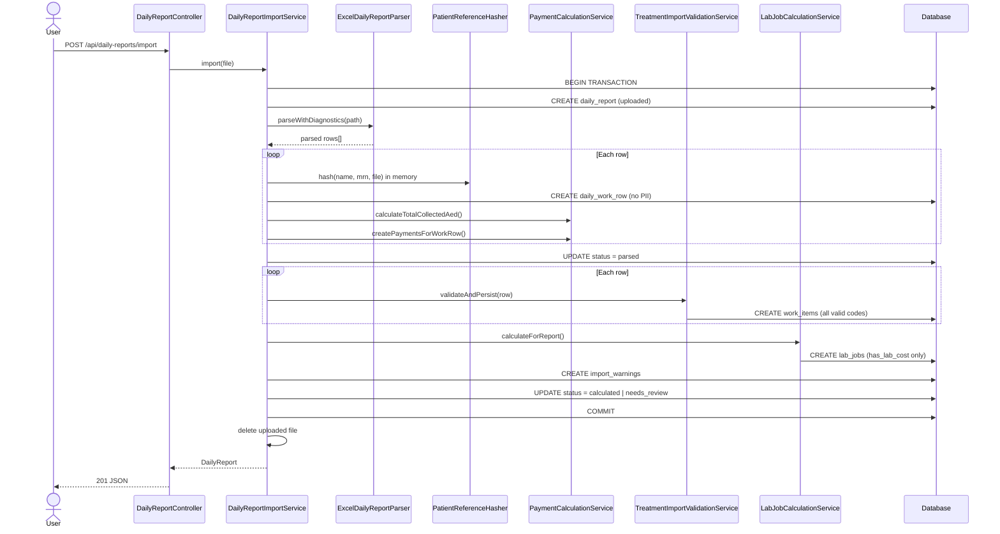
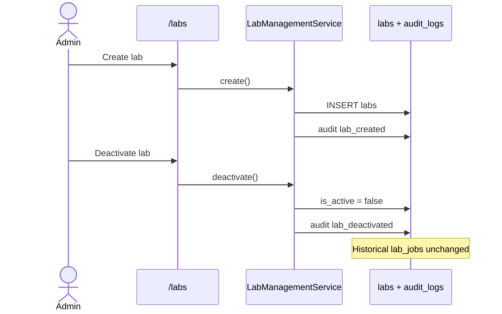
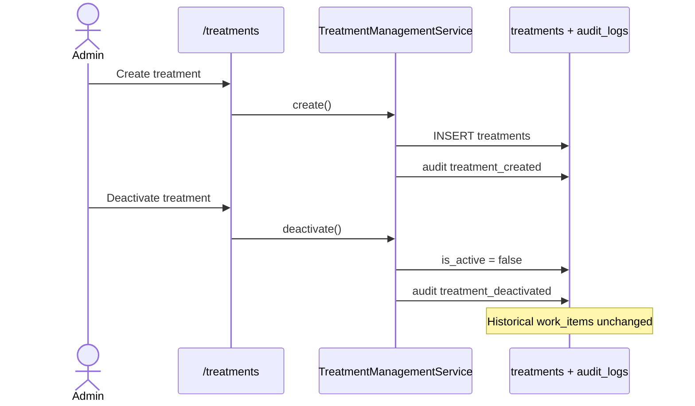
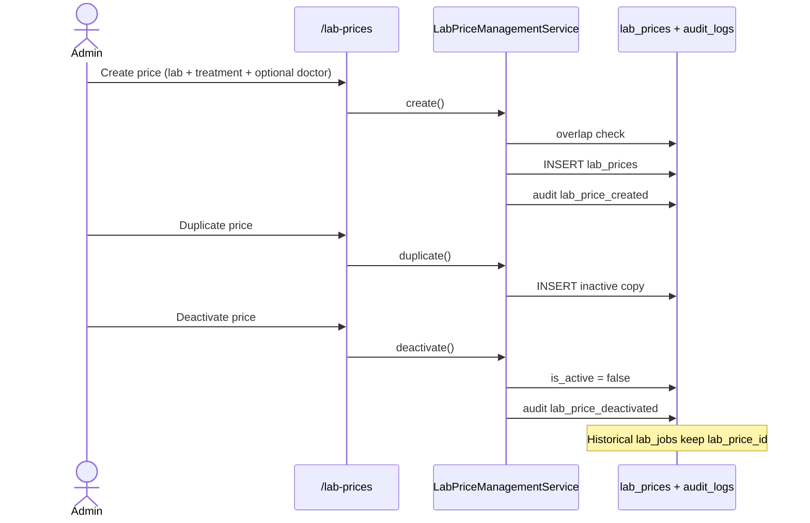
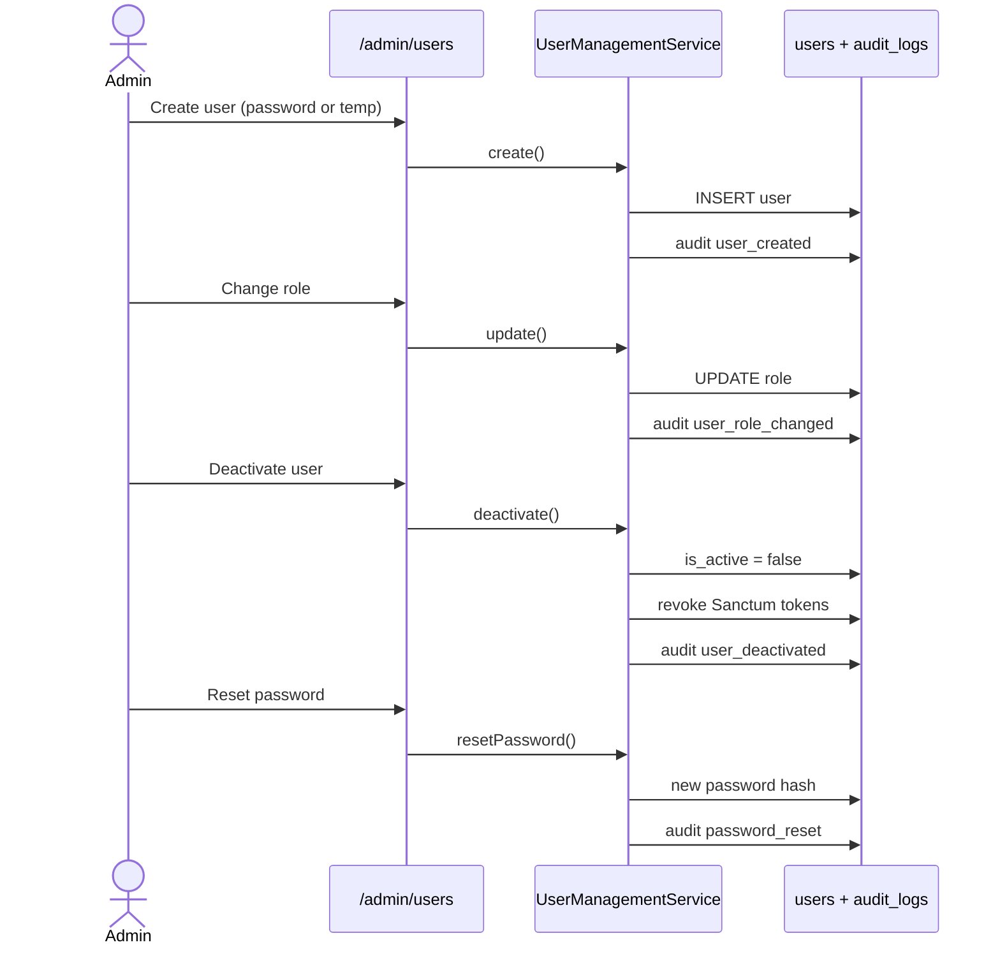
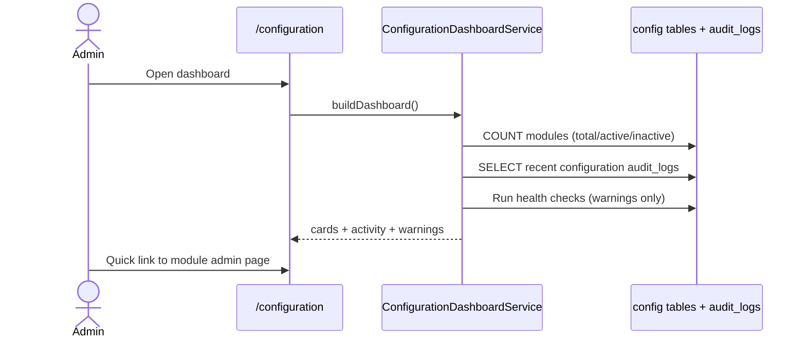
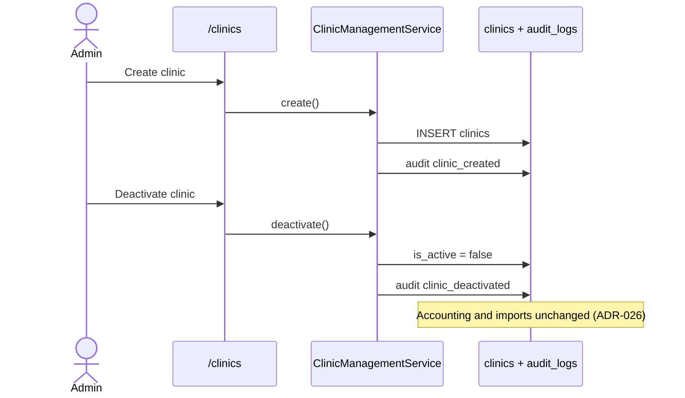
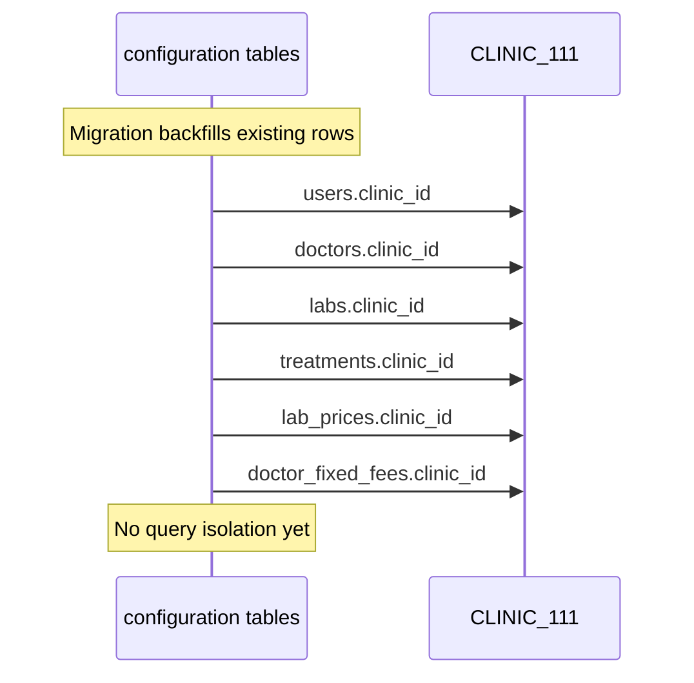
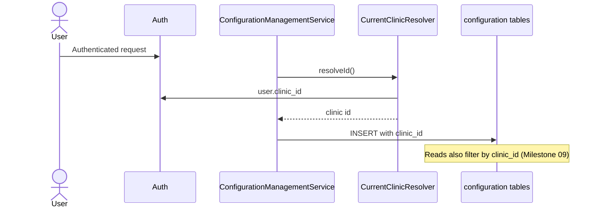
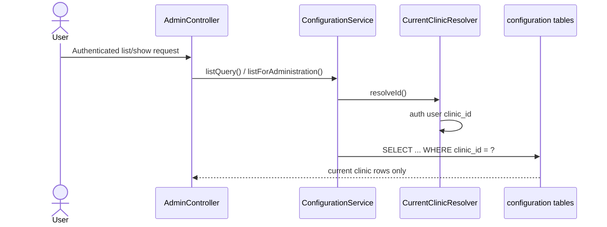

# Workflows

Step-by-step descriptions of every major process in the system.

---

## 1. Daily Excel Import

### Overview

An accountant uploads a daily Excel file. The system extracts rows, applies privacy rules, validates treatments, calculates lab jobs, and sets report status — inside a single database transaction. The uploaded Excel file is deleted after success (configurable).

### Web UI (drag & drop — recommended)

1. Start server: `./bin/serve`
2. Login at `/login` with `accountant@clinic.test` / `password`
3. Drag Excel file onto the import page (or click to browse)
4. Report month is resolved from the filename (e.g. `daily report january 2026.xlsm`)
5. After import, view results at `/imports/{id}` and logs at `/logs`
6. If parser warnings exist, status is `needs_review` — check `GET /api/daily-reports/{id}/validation-summary`

### Treatment text rules

Staff who fill the daily Excel must use **`CODE x QUANTITY`** in **UPPERCASE** (e.g. `ZIR x 2 + POST x 1`).  
See **`docs/TREATMENT_RULES.md`** and web page **`/docs/treatment-rules`**.

Invalid lines produce warnings (not silent skips): unknown code, missing quantity, invalid format, missing lab price.

### Steps (API / curl)

1. **User authenticates** — Sanctum token via `POST /api/login`.
2. **User uploads Excel** — `POST /api/daily-reports/import` with `multipart/form-data`.
3. **Validation** — file type (`.xlsx`, `.xlsm`), size limit.
4. **Approved report guard** — rejected if an approved report exists for the same month anchor.
5. **File storage** — saved to private disk (`storage/app/daily-reports/`).
6. **`DailyReportImportService::import()` begins DB transaction.**
7. **Create `daily_report`** — status = `uploaded`.
8. **`ExcelDailyReportParser`** — reads day sheets 1–31, maps columns, extracts rows. Patient name/MRN/file read **in memory only**.
9. **For each parsed row:**
   - Resolve doctor by code or name.
   - Compute `paid_total_aed` via `PaymentCalculationService`.
   - Hash patient identifiers → `patient_reference_hash` (HMAC-SHA256, dedicated env key).
   - Sanitize PII from `raw_data_json`.
   - Store `excel_row_number` for traceability.
   - Create `daily_work_row` + `payments`.
10. **Update status** → `parsed`.
11. **`TreatmentImportValidationService::validateAndPersist()`** — per row:
    - Split `treatment_text` on `+` (and ` | ` patient segments).
    - Emit warnings for invalid format / unknown code / missing quantity.
    - Create **`work_items` for all valid known treatments** (CF, REMOV, ZIR, …).
12. **`LabJobCalculationService::calculateForReport()`** — for work items where `has_lab_cost = true`, resolve price → create `lab_jobs`. Non-lab treatments (CF, RCT, …) skip lab job.
13. **Collect lab-price warnings** — work items with lab cost but no matching `lab_price`.
14. **Persist warnings** → `daily_report_import_warnings`.
15. **Reconciliation** — `IncomeReconciliationService::validateReport()`.
16. **Final status** → `calculated` if no warnings, else `needs_review`.
17. **Extraction log** — structured import log written.
18. **Transaction commits** — return report JSON (no patient names).
19. **Delete uploaded Excel** — when `ACCOUNTING_DELETE_UPLOAD_AFTER_IMPORT=true` (default).
20. **On failure** — rollback, status = `failed`.

### Sequence Diagram



### Data Flow Diagram

```
Excel file (deleted after import)
    ↓
ExcelDailyReportParser     ← extract only (doctor, amounts, treatment_text, row#)
    ↓                        patient fields: memory only → HMAC hash
daily_reports              (1 per import)
    ↓
daily_work_rows            (patient_reference_hash, excel_row_number, sanitized raw_data_json)
    ↓                    ↓
payments               treatment_text
(collected $)              ↓
              TreatmentImportValidationService
              (warnings → daily_report_import_warnings)
                            ↓
                       work_items          ← ALL valid treatments
                       (CF, REMOV, ZIR, …)
                            ↓
                       lab_jobs            ← ONLY has_lab_cost = true
                       (MC, ZIR, REMOV, …)
                            ↓
                    monthly_income / Income Excel export
```

---

## 2. Daily Report Review

### Steps

1. `GET /api/daily-reports/{id}` — full report with work items and lab jobs (no patient names).
2. `GET /api/daily-reports/{id}/validation-summary` — parser warning counts and messages.
3. Web UI: `/imports/{id}` for staff review.

Loaded relations:

- `dailyWorkRows.doctor`
- `dailyWorkRows.payments`
- `dailyWorkRows.workItems.treatment`
- `dailyWorkRows.workItems.labJob.lab`

---

## 3. Treatment Parsing vs Import Validation

Two layers — do not confuse them.

### A. Extractor (`ExcelDailyReportParser`)

Reads Excel cells. Does **not** parse treatment codes. Output includes `treatment_text` as raw string plus payment columns and `raw_row_number`.

### B. Parser (`TreatmentParserService::parse()`)

Pure function: `treatment_text` → `ParsedTreatmentItemDto[]`.

- Splits on ` | ` (patient segments) and `+` (multiple procedures).
- Longest code match first (`IMPL-ZIR` before `IMPL`).
- Supports tooth notation (`CF 876`, `MC CR 8765|5678`).
- Used by validation and unit tests; does not write to DB alone during import.

### C. Import validation (`TreatmentImportValidationService`)

Runs during import after rows are saved.

| Check | Warning code |
|---|---|
| Unknown treatment code | `unknown_treatment_code` |
| Missing quantity | `missing_quantity` |
| Invalid format (e.g. `zircon 2`) | `invalid_format` |
| Lab cost but no lab price | `lab_price_not_found` |

**Persistence rule:**

```
valid known treatment  →  work_item  (always)
has_lab_cost = true    →  lab_job    (via LabJobCalculationService)
has_lab_cost = false   →  no lab_job (CF, AF, RCT, RE-RCT, REPAIR, …)
```

**Example:**

```
Input:  "ZIR x 2 + CF x 3 + zircon 2"
Output: work_items: ZIR×2, CF×3
        warning: invalid_format on "zircon 2"
        lab_jobs: ZIR×2 only (CF has no lab cost)
        status: needs_review
```

---

## 4. Lab Job Calculation

Runs automatically during import after work items are created.

### Steps

1. Load all work items for the report.
2. For each work item:
   - Skip if `treatment.has_lab_cost = false`.
   - Resolve lab via doctor's `default_lab_id`.
   - Resolve unit price via `LabPriceResolver`.
   - `total_cost_aed = quantity × unit_cost`.
   - Create `lab_job` with status `calculated`.

### Example

```
REMOV x 2  →  lab_job: 2 × 100 = 200 AED JOB
CF x 3     →  work_item only, no lab_job
ZIR x 4 Dr Riyad  →  lab_job: 4 × 400 = 1600 AED
```

---

## 5. Monthly Income Calculation

On-demand via `GET /api/monthly-income?month=YYYY-MM`.

Same as before — aggregates `payments`, `lab_jobs`, and `work_items` per doctor for the calendar month.

---

## 6. Authentication

Unchanged — Sanctum bearer tokens, rate-limited login.

---

## 7. Role-Based Access

| Action | admin | accountant | viewer |
|---|---|---|---|
| Login | ✓ | ✓ | ✓ |
| List doctors/treatments/labs | ✓ | ✓ | ✓ |
| Import daily report | ✓ | ✓ | ✗ |
| View daily report | ✓ | ✓ | ✓ |
| View validation summary | ✓ | ✓ | ✓ |
| View monthly income | ✓ | ✓ | ✓ |
| Manage users (`/admin/users`) | ✓ | ✗ | ✗ |
| Manage laboratories (`/labs`) | ✓ | ✗ | ✗ |
| Manage treatments (`/treatments`) | ✓ | ✗ | ✗ |
| Manage lab prices (`/lab-prices`) | ✓ | ✗ | ✗ |
| Manage doctor fixed fees (`/doctor-fixed-fees`) | ✓ | ✗ | ✗ |
| Configuration dashboard (`/configuration`) | ✓ | ✗ | ✗ |
| Approve / unlock reports | ✓ | ✗ | ✗ |
| Manage doctors | ✓ | ✗ | ✗ |

---

## 8. Laboratory Administration (admin only)



**Rules:**

- Laboratories are never physically deleted
- `GET /api/labs` (reference) still returns active labs only for accountants/viewers
- Deactivated labs are excluded from new JOB calculations only

---

## 9. Treatment Administration (admin only)



**Rules:**

- Treatments never physically deleted
- `LabCostTreatmentCatalog` reads `has_lab_cost` from database (no hardcoded code list)
- Parser and editor use active treatments only for new entries

---

## 10. Lab Price Administration (admin only)



**Rules:**

- Lab prices never physically deleted
- General price: `doctor_id IS NULL`; doctor override: `doctor_id` set
- Only one active price per lab + treatment + doctor + overlapping validity period
- `LabPriceResolver` unchanged — reads active rows with date validity
- Seed data in `LabPriceSeeder` is initial data only, not runtime logic

---

## 11. Doctor Fixed Fee Administration (admin only)

```mermaid
sequenceDiagram
    actor Admin
    participant UI as /doctor-fixed-fees
    participant Svc as DoctorFixedFeeManagementService
    participant DB as doctor_fixed_fees + audit_logs

    Admin->>UI: Create fee (fixed doctor + treatment)
    UI->>Svc: create()
    Svc->>DB: overlap check
    Svc->>DB: INSERT doctor_fixed_fees
    Svc->>DB: audit doctor_fixed_fee_created

    Admin->>UI: Duplicate fee
    UI->>Svc: duplicate()
    Svc->>DB: INSERT inactive copy

    Admin->>UI: Deactivate fee
    UI->>Svc: deactivate()
    Svc->>DB: is_active = false
    Svc->>DB: audit doctor_fixed_fee_deactivated

    Note over DB: Accounting engine unchanged; resolver reads active rows
```

**Rules:**

- Fixed fees never physically deleted
- Only doctors with `commission_type = fixed` may have rows
- Only one active fee per doctor + treatment + overlapping validity period
- `DoctorFixedFeeResolver` used by editor catalog; `WaelFixedFeeCalculator` and monthly income logic unchanged
- Seed data in `DoctorFixedFeeSeeder` is initial data only, not runtime logic

---

## 12. User Administration (admin only)



**Rules:**

- Users are never physically deleted — `is_active = false`
- Deactivated users cannot log in (web session or API token)
- Admins cannot deactivate themselves or change their own role
- Temporary passwords are shown once in the success flash / API response

---

## 13. Configuration Dashboard (admin only)



**Rules:**

- Single entry point for all configuration modules (ADR-025)
- Health warnings are informational only — never auto-modify data
- Recent activity shows configuration-related audit actions only
- Accounting engine is not invoked from the dashboard
- Designed for future `clinic_id` filtering without schema changes in Milestone 05

---

## 14. Clinic Administration (admin only)



**Rules:**

- Clinics are never physically deleted
- `ClinicSeeder` creates exactly one default tenant: `CLINIC_111`
- No `clinic_id` on users, doctors, labs, or accounting tables yet
- Accounting engine, imports, and login do not use clinic context in Milestone 06

---

## 15. Configuration Clinic Ownership (Milestone 07)

All configuration models now store `clinic_id` pointing to `clinics.id`.



**Rules:**

- Every seeded configuration record belongs to `CLINIC_111`
- Seeders resolve clinic by code — never hardcode clinic IDs
- New configuration rows receive `clinic_id` from `CurrentClinicResolver` (Milestone 08, ADR-027)
- Admin CRUD, APIs, imports, and accounting behaviour unchanged until Milestone 09

---

## 16. Current Clinic Resolver (Milestone 08)



**Rules:**

- Single source of truth per request (ADR-027)
- No `CLINIC_111` fallback
- Controllers remain thin — services own clinic assignment and query scoping
- Accounting engine unchanged

---

## 17. Explicit Query Isolation (Milestone 09, ADR-028)



**Rules:**

- Every configuration read uses explicit `where('clinic_id', …)` in services — no global scopes
- Controllers never call `auth()->user()->clinic_id` or build tenant queries
- Cross-clinic route-model binding returns **404** on update/deactivate/activate
- Reference APIs (`/api/doctors`, `/api/treatments`, `/api/labs`) scoped via `ReferenceDataService`
- Configuration dashboard counts, health warnings, and recent activity are clinic-specific
- Accounting tables (`daily_reports`, `payments`, `lab_jobs`, …) remain unscoped

---

## 18. Environment Variables (import / privacy)

| Variable | Purpose |
|---|---|
| `ACCOUNTING_PATIENT_REFERENCE_HMAC_KEY` | Dedicated secret for patient reference hashing (**required**, not `APP_KEY`) |
| `ACCOUNTING_DELETE_UPLOAD_AFTER_IMPORT` | Delete Excel after successful import (default `true`) |
| `ACCOUNTING_USD_EXCHANGE_RATE` | USD → AED (default `3.65`) |

---

## 13. V2 Manual Entry (Planned)

Same pipeline after row creation: `TreatmentImportValidationService` → `LabJobCalculationService`. No Excel parser.

---

## What Changed

**Updated — 2026-06-26**

- Explicit query isolation workflow (Milestone 09, ADR-028)
- Configuration clinic ownership workflow (Milestone 07, ADR-026)
- Current clinic resolver workflow (Milestone 08, ADR-027)

**Updated — 2026-06-26**

- Clinic administration workflow (Milestone 06, ADR-026)

**Updated — 2026-06-25**

- Laboratory administration workflow (Milestone 01)

**Updated — 2026-06-26**

- Lab price administration workflow (Milestone 03)
- Treatment administration workflow (Milestone 02)
- Database-driven `LabCostTreatmentCatalog`

**Updated — 2026-06-25**

- Laboratory administration workflow (`/admin/users`, admin-only)
- Extended RBAC table with user management and master data

**Updated — 2026-06-19**

- Privacy-safe import: HMAC patient reference, no plain-text PII in DB or API
- `TreatmentImportValidationService` with warnings and `needs_review` status
- `GET /api/daily-reports/{id}/validation-summary`
- All valid treatments → `work_items`; lab jobs only when `has_lab_cost`
- Upload file deleted after successful import
- Extractor vs parser vs validation documented separately

**Initial documentation — 2026-06-19**

Created import, parse, calculate, monthly report, and auth workflows with Mermaid diagrams.
