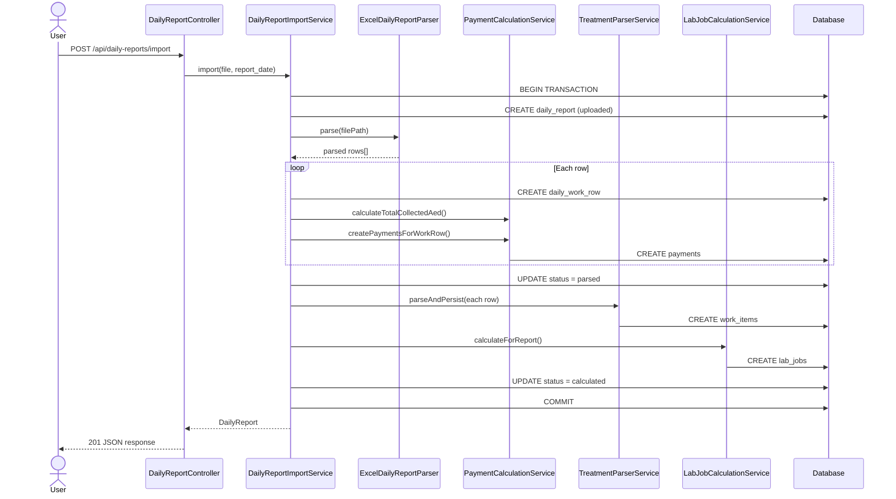
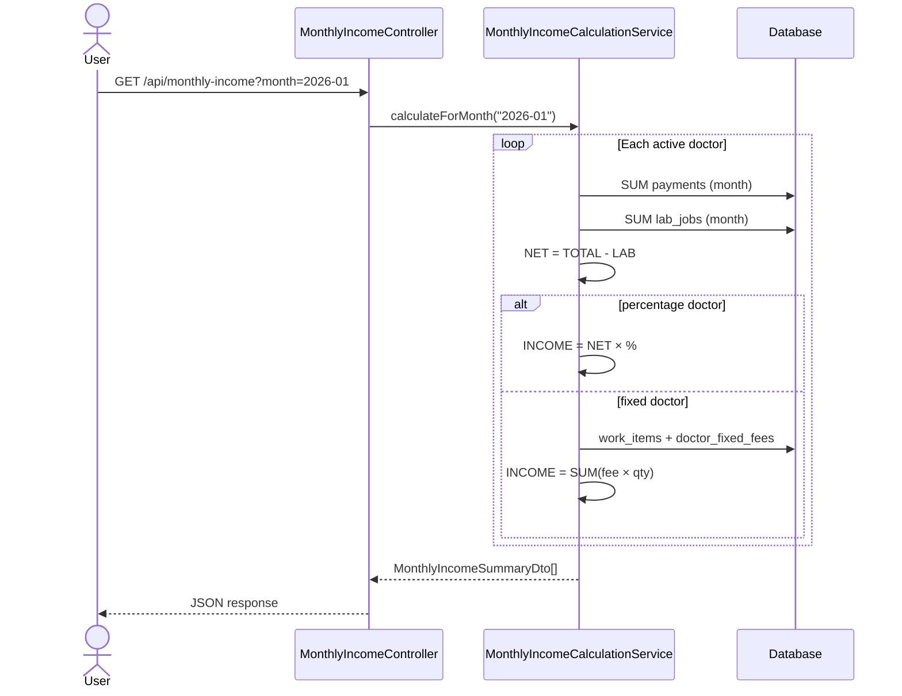

# Workflows

Step-by-step descriptions of every major process in the system.

---

## 1. Daily Excel Import

### Overview

An accountant uploads a daily Excel file. The system parses it, creates all database records, and runs the full calculation pipeline inside a single database transaction.

### Web UI (drag & drop — recommended)

1. Start server: `./bin/serve`
2. Login at `/login` with `accountant@clinic.test` / `password`
3. Drag Excel file onto the import page (or click to browse)
4. Optionally set report date to first day of month (e.g. `2026-01-01` for January workbook)
5. After import, view results at `/imports/{id}` and logs at `/logs`

### Steps (API / curl)

1. **User authenticates** — obtains Sanctum API token via `POST /api/login`.
2. **User uploads Excel** — `POST /api/daily-reports/import` with `multipart/form-data`.
3. **Validation** — `ImportDailyReportRequest` checks file type (`.xlsx`, `.xlsm`), size, and optional `report_date`.
4. **Approved report guard** — if an approved report exists for the same date, import is rejected.
5. **File storage** — file saved to private disk (`storage/app/daily-reports/`), not public.
6. **`DailyReportImportService::import()` begins DB transaction.**
7. **Create `daily_report`** — status = `uploaded`, source = `excel_upload`.
8. **`ExcelDailyReportParser` reads file** — detects header row, maps columns, extracts rows. Original cell data stored in `raw_data_json`.
9. **For each parsed row:**
   - Resolve doctor by code or name match against `doctors` table.
   - Calculate `paid_total_aed` via `PaymentCalculationService`.
   - Create `daily_work_row`.
   - Create `payments` rows for DHS, USD, VISA (skip zero amounts).
10. **Update status** → `parsed`.
11. **`TreatmentParserService::parseAndPersist()`** — for each row, parse `treatment_text` → create `work_items`.
12. **`LabJobCalculationService::calculateForReport()`** — for each work item with lab cost, resolve price → create `lab_jobs`.
13. **Update status** → `calculated`.
14. **`ImportActivityLogger`** — writes to `import` log channel (`storage/logs/import-*.log`) and `audit_logs` table.
15. **Transaction commits** — return full report JSON.
16. **On failure** — transaction rolls back, report status set to `failed`.

### Sequence Diagram



### Data Flow Diagram

```
Excel file
    ↓
daily_reports          (1 per import)
    ↓
daily_work_rows        (1 per Excel row)
    ↓                    ↓
payments               treatment_text
(collected $)              ↓
                       work_items
                       (parsed codes)
                            ↓
                       lab_jobs
                       (lab costs)
                            ↓
                    monthly_income
                    (aggregated view)
```

---

## 2. Daily Report Review

### Steps

1. User calls `GET /api/daily-reports/{id}`.
2. Controller loads report with nested relations:
   - `dailyWorkRows.doctor`
   - `dailyWorkRows.payments`
   - `dailyWorkRows.workItems.treatment`
   - `dailyWorkRows.workItems.labJob.lab`
3. JSON response returned with full calculated data.

---

## 3. Treatment Parsing

Runs automatically during import (step 11 above). Can also be triggered independently via `TreatmentParserService::parseAndPersist()`.

### Steps

1. Read `daily_work_row.treatment_text`.
2. Load all active treatment codes from database.
3. Sort codes longest-first (so `IMPL-ZIR` matches before `IMPL`).
4. Apply regex patterns to detect `CODE`, `CODE x N`, `CODE N`.
5. For each match, create `ParsedTreatmentItemDto`.
6. If code found but quantity unclear → quantity = 1, confidence = 80, warning set.
7. Persist as `work_items` linked to treatment_id.

### Example

```
Input:  "ZIR 4 + POST 2"
Output: work_items: ZIR qty 4, POST qty 2
```

---

## 4. Lab Job Calculation

Runs automatically during import (step 12 above).

### Steps

1. Load all work items for the report.
2. For each work item:
   - Skip if `treatment.has_lab_cost = false`.
   - Resolve lab via doctor's `default_lab_id`.
   - Resolve unit price via `LabPriceResolver` (doctor-specific → default).
   - Convert price to AED if needed.
   - Calculate `total_cost_aed = quantity × unit_cost`.
   - Create `lab_job` with status `calculated`.

---

## 5. Monthly Income Calculation

On-demand via `GET /api/monthly-income?month=YYYY-MM`.

### Steps

1. Validate month format (`YYYY-MM`).
2. For each active doctor:
   - Sum `payments.amount_aed` where `paid_at` in month → TOTAL.
   - Sum `lab_jobs.total_cost_aed` where `work_date` in month → LAB COST.
   - Calculate NET TOTAL = TOTAL - LAB COST.
   - If percentage doctor → DOCTOR INCOME = NET TOTAL × percentage.
   - If fixed doctor → DOCTOR INCOME = SUM(fixed_fee × quantity) from work_items.
   - CLINIC INCOME = NET TOTAL - DOCTOR INCOME.
   - Count work_items by treatment code.
3. Return array of `MonthlyIncomeSummaryDto`.

### Sequence Diagram



---

## 6. Authentication

### Login

1. `POST /api/login` with email + password.
2. Credentials validated via `LoginRequest`.
3. Sanctum token created and returned.
4. Rate limited: 10 requests per minute.

### Authenticated Requests

All other endpoints require header:

```
Authorization: Bearer {token}
```

### Logout

1. `POST /api/logout`
2. Current access token deleted.

---

## 7. Role-Based Access

| Action | admin | accountant | viewer |
|---|---|---|---|
| Login | ✓ | ✓ | ✓ |
| List doctors/treatments/labs | ✓ | ✓ | ✓ |
| Import daily report | ✓ | ✓ | ✗ |
| View daily report | ✓ | ✓ | ✓ |
| View monthly income | ✓ | ✓ | ✓ |

Enforced by `EnsureUserHasRole` middleware (`role:admin,accountant,...`).

---

## 8. V2 Manual Entry (Planned)

Not implemented in V1, but the schema supports it:

1. Create `daily_report` with `source_type = manual_entry`.
2. Create `daily_work_rows` via web form (same fields as Excel import).
3. Call same services: `PaymentCalculationService` → `TreatmentParserService` → `LabJobCalculationService`.
4. No Excel parser involved.

---

## What Changed

**Initial documentation — 2026-06-19**

Created:

- `docs/WORKFLOWS.md` — import, parse, calculate, monthly report, auth workflows with Mermaid diagrams
